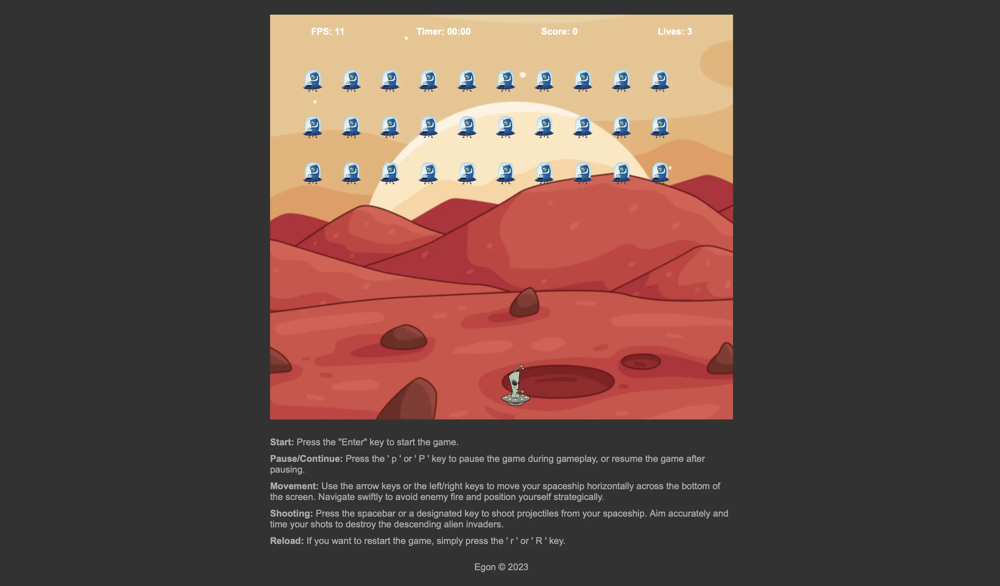

# Galaxy Attack Game

This is a simple galaxy attack game built with JavaScript. The objective of the game is to control a spaceship and shoot down enemy spaceships while avoiding their projectiles. The game includes features such as player movement, shooting weapons, enemy generation, enemy shooting, scoring, and lives count.

## Instructions

1. Use the `arrow keys` (left and right) to move the player spaceship horizontally.
2. Press the `space bar` to shoot from the player spaceship.
3. Avoid the enemy spaceships and their projectiles.
4. Earn points by shooting down enemy spaceships.
5. The game ends when all lives are lost or all enemy spaceships are destroyed.
  
## How to Run the Game

To run the game, follow these steps:

1. Open the `index.html` file in a web browser.
2. The game will start automatically.

## Code Explanation

The game is built using JavaScript and HTML. Here is an explanation of the key components and functions in the code:

## Player

The `createPlayer` function initializes the player spaceship by creating an HTML element and setting its initial position.

The `updatePlayer` function updates the player's position based on user input and handles shooting.

## Weapons

The `createWeapon` function creates a weapon for the player and adds it to the game container.

The `updateWeapon` function updates the position of player weapon, checks for collisions with enemy spaceships, and handles weapon removal.

## Enemies

The `createEnemy` function creates an enemy spaceship and adds it to the game container.

The `updateEnemies` function updates the positions of enemy spaceships, generates enemy projectiles, and handles their removal.

## Game Status

The `gameStatus` object keeps track of the player's score, remaining lives, and game over state.

## General Functions

The `setPosition` and `setSize` functions are utility functions to set the position and size of HTML elements.

The `bound` function keeps the player spaceship within the game boundaries.

The `collideRect` function checks for hit when shooting.

## Event Listeners

The game listens for keydown and keyup events to handle player movement and shooting.

## Update Function and Game Loop

The `update` function is the main update loop of the game. It updates various game elements based on elapsed time and requests the next animation frame for continuous updates. The game loop continues until the game is over.

## Initialization

The game is initialized by creating the player spaceship and enemies, and setting up event listeners. The game loop is started using window.requestAnimationFrame.

## Credits

This game is developed by `Egon`
